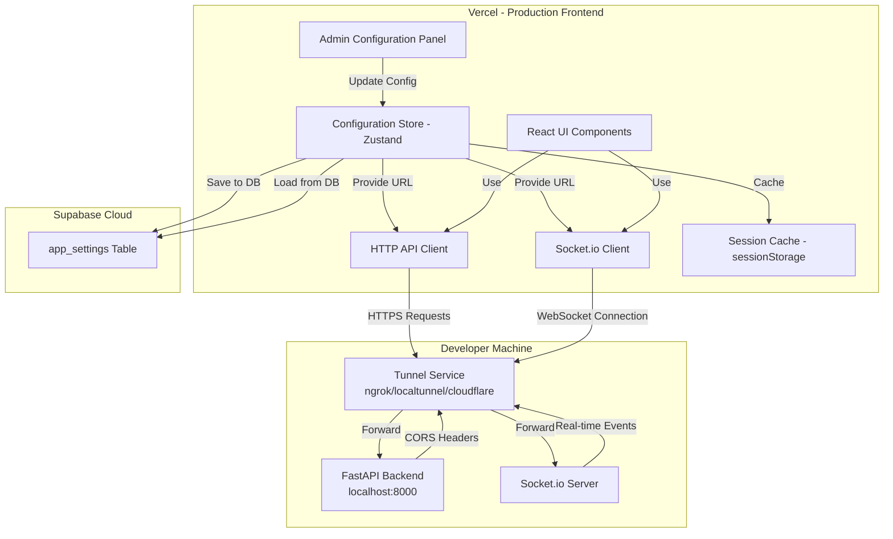
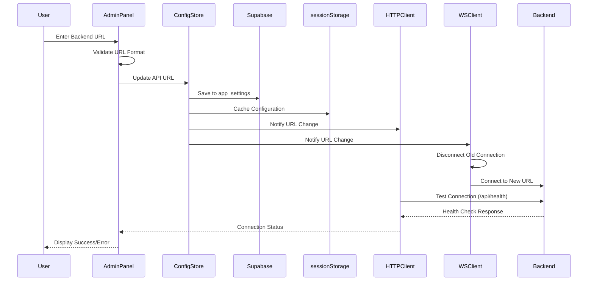
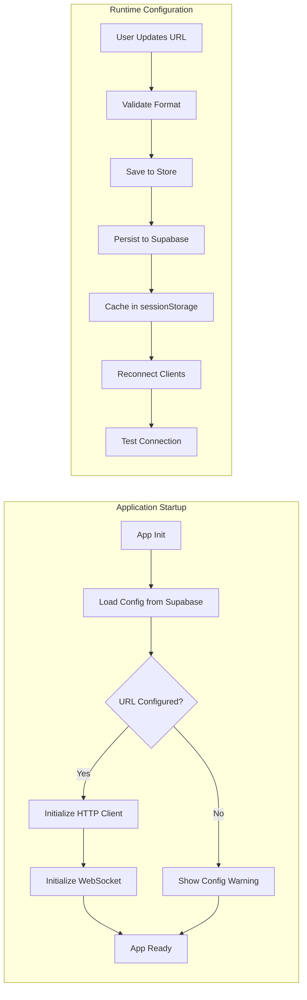

# Design Document: Configurable Backend URL

## Overview

Esta funcionalidade implementa um sistema de configuração runtime que permite ao frontend React hospedado no Vercel conectar-se dinamicamente a um backend FastAPI rodando localmente. A solução elimina a necessidade de rebuild do frontend ao alternar entre diferentes backends, suportando tanto conexões HTTP (REST API) quanto WebSocket (Socket.io).

O sistema é composto por três camadas principais:
1. **Configuration Layer**: Gerencia persistência e validação da URL do backend
2. **Connection Layer**: Adapta clientes HTTP e WebSocket para usar a URL configurada
3. **UI Layer**: Fornece interface administrativa para configuração e monitoramento

### Key Design Decisions

- **Runtime Configuration**: Configuração carregada do localStorage sem variáveis de ambiente obrigatórias
- **Centralized State Management**: Zustand store para gerenciar configuração global
- **Graceful Degradation**: Sistema funciona mesmo sem backend configurado, exibindo avisos apropriados
- **Automatic Reconnection**: Reconexão automática de HTTP e WebSocket ao alterar configuração
- **CORS Flexibility**: Backend configurável via variável de ambiente para aceitar múltiplas origens

## Architecture

### System Architecture



### Configuration Flow



### Data Flow



## Components and Interfaces

### Frontend Components

#### 1. Configuration Store (Zustand)

**File**: `frontend/src/store/useConfigStore.js`

```javascript
// Store interface
{
  apiUrl: string | null,
  isConfigured: boolean,
  connectionStatus: 'connected' | 'disconnected' | 'testing',
  
  // Actions
  setApiUrl: (url: string) => Promise<void>,
  clearApiUrl: () => Promise<void>,
  testConnection: () => Promise<boolean>,
  loadFromSupabase: () => Promise<void>,
}
```

**Responsibilities**:
- Gerenciar estado global da configuração
- Persistir/restaurar do Supabase (tabela app_settings)
- Cache em sessionStorage para performance
- Validar formato de URLs
- Coordenar reconexão de clientes

#### 2. HTTP API Client

**File**: `frontend/src/services/api.js` (modificado)

```javascript
// Current implementation uses relative paths
// New implementation will use configurable base URL

class APIClient {
  constructor(configStore) {
    this.configStore = configStore
  }
  
  getBaseUrl() {
    return this.configStore.getState().apiUrl || ''
  }
  
  async request(path, options) {
    const baseUrl = this.getBaseUrl()
    if (!baseUrl) {
      throw new Error('Backend URL not configured')
    }
    // Make request to ${baseUrl}/api${path}
  }
}
```

**Responsibilities**:
- Construir URLs completas usando configuração
- Adicionar headers apropriados
- Tratar erros de rede e CORS
- Fornecer mensagens de erro descritivas

#### 3. WebSocket Hook

**File**: `frontend/src/hooks/useWebSocket.js` (modificado)

```javascript
// Current: connects to '/' (relative)
// New: connects to configured URL

function useWebSocket() {
  const apiUrl = useConfigStore(s => s.apiUrl)
  
  useEffect(() => {
    if (!apiUrl) return // Don't connect without URL
    
    const socket = io(apiUrl, {
      transports: ['websocket', 'polling'],
      reconnectionAttempts: 5,
      reconnectionDelay: 3000,
    })
    
    // Event handlers...
    
    return () => socket.disconnect()
  }, [apiUrl]) // Reconnect when URL changes
}
```

**Responsibilities**:
- Estabelecer conexão Socket.io com URL configurada
- Reconectar automaticamente ao mudar URL
- Manter configurações de reconnection existentes
- Tratar erros de conexão gracefully

#### 4. Admin Configuration Panel

**File**: `frontend/src/pages/AdminConfigPage.jsx` (novo)

```javascript
// Component structure
function AdminConfigPage() {
  const { apiUrl, setApiUrl, clearApiUrl, testConnection, connectionStatus } = useConfigStore()
  const [inputUrl, setInputUrl] = useState(apiUrl || '')
  const [error, setError] = useState(null)
  
  const handleSave = async () => {
    // Validate URL format
    // Save to store
    // Test connection
    // Show feedback
  }
  
  return (
    // UI with:
    // - URL input field
    // - Connection status indicator
    // - Save/Clear buttons
    // - Example URLs
    // - Error messages
  )
}
```

**Responsibilities**:
- Fornecer interface para configuração
- Validar entrada do usuário
- Exibir status de conexão
- Mostrar exemplos e ajuda
- Fornecer feedback claro sobre erros

#### 5. Connection Status Indicator

**File**: `frontend/src/components/ConnectionStatus.jsx` (novo)

```javascript
// Small indicator component
function ConnectionStatus() {
  const { connectionStatus, isConfigured } = useConfigStore()
  
  // Display badge/icon showing:
  // - Not configured (warning)
  // - Connected (success)
  // - Disconnected (error)
  // - Testing (loading)
}
```

**Responsibilities**:
- Exibir status visual da conexão
- Alertar sobre configuração pendente
- Ser discreto e não intrusivo

### Backend Components

#### 1. CORS Middleware Configuration

**File**: `backend/main.py` (modificado)

```python
# Current implementation
app.add_middleware(
    CORSMiddleware,
    allow_origins=os.getenv("CORS_ORIGINS", "http://localhost:5173").split(","),
    allow_credentials=True,
    allow_methods=["*"],
    allow_headers=["*"],
)

# Enhanced to support multiple origins including Vercel
# CORS_ORIGINS="http://localhost:5173,https://your-app.vercel.app,https://*.vercel.app"
```

**Responsibilities**:
- Ler origens permitidas da variável de ambiente
- Suportar múltiplas origens separadas por vírgula
- Permitir wildcard para subdomínios Vercel
- Manter configuração de credentials e headers

#### 2. Socket.io Server Configuration

**File**: `backend/main.py` (modificado)

```python
# Current implementation
sio = socketio.AsyncServer(
    async_mode="asgi",
    cors_allowed_origins="*",  # Too permissive
    logger=False,
    engineio_logger=False
)

# Enhanced to match CORS policy
sio = socketio.AsyncServer(
    async_mode="asgi",
    cors_allowed_origins=os.getenv("CORS_ORIGINS", "http://localhost:5173").split(","),
    logger=False,
    engineio_logger=False
)
```

**Responsibilities**:
- Sincronizar política CORS com FastAPI
- Aceitar conexões das origens configuradas
- Manter compatibilidade com configuração existente

#### 3. Health Check Endpoint

**File**: `backend/main.py` (já existe)

```python
@app.get("/api/health")
async def health():
    return {"status": "ok", "version": "1.0.0"}
```

**Responsibilities**:
- Fornecer endpoint para teste de conectividade
- Retornar informações básicas do servidor
- Responder rapidamente para validação

## Data Models

### Configuration Model

```typescript
interface BackendConfig {
  apiUrl: string | null          // Full URL including protocol (e.g., "https://abc123.ngrok.io")
  lastUpdated: number             // Timestamp of last configuration change
  isConfigured: boolean           // Derived: apiUrl !== null
}

interface AppSetting {
  id: number                      // Auto-increment primary key
  key: string                     // Setting key (e.g., "backend_api_url")
  value: string                   // Setting value (JSON string or plain text)
  created_at: string              // ISO timestamp
  updated_at: string              // ISO timestamp
}
```

### Connection Status Model

```typescript
type ConnectionStatus = 
  | 'connected'      // Backend is reachable and responding
  | 'disconnected'   // Backend is not reachable
  | 'testing'        // Currently testing connection
  | 'unconfigured'   // No URL configured yet
```

### Health Check Response

```typescript
interface HealthCheckResponse {
  status: 'ok' | 'error'
  version: string
  timestamp?: number
}
```

### localStorage Schema

```javascript
// Supabase app_settings table schema
CREATE TABLE app_settings (
  id BIGSERIAL PRIMARY KEY,
  key TEXT UNIQUE NOT NULL,
  value TEXT,
  created_at TIMESTAMPTZ DEFAULT NOW(),
  updated_at TIMESTAMPTZ DEFAULT NOW()
);

// Example row for backend URL:
{
  "id": 1,
  "key": "backend_api_url",
  "value": "https://abc123.ngrok.io",
  "created_at": "2024-01-15T10:30:00Z",
  "updated_at": "2024-01-15T14:20:00Z"
}

// sessionStorage cache (for performance)
// Key: "prospecta_config_cache"
// Value: JSON string
{
  "backend_api_url": "https://abc123.ngrok.io",
  "cached_at": 1705324800000
}
```

### Environment Variables

**Backend (.env)**:
```bash
CORS_ORIGINS=http://localhost:5173,https://your-app.vercel.app
```

**Frontend (Vercel Environment Variables)** - Optional:
```bash
VITE_DEFAULT_API_URL=https://default-backend.example.com
```


## Correctness Properties

*A property is a characteristic or behavior that should hold true across all valid executions of a system—essentially, a formal statement about what the system should do. Properties serve as the bridge between human-readable specifications and machine-verifiable correctness guarantees.*

### Property Reflection

Após análise dos critérios de aceitação, identifiquei as seguintes redundâncias:
- **1.4 e 9.1/9.2**: Ambos testam persistência no localStorage - podem ser combinados em uma propriedade de round-trip
- **1.6 e 2.3**: Ambos testam validação de URL - mesma propriedade
- **4.3 e 4.4**: Desconexão e reconexão são parte do mesmo comportamento - podem ser combinados

As propriedades finais eliminam essas redundâncias e focam em validações únicas.

### Property 1: URL Validation

*For any* string input, the validation function should return true if and only if the string starts with "http://" or "https://" and is a valid URL format.

**Validates: Requirements 1.6, 2.3**

### Property 2: Configuration Persistence Round-Trip

*For any* valid API URL, saving it to Supabase and then retrieving it should return the exact same URL value.

**Validates: Requirements 1.4, 9.1, 9.2**

### Property 3: URL Prefix Application

*For any* configured API URL and any relative endpoint path, the HTTP client should construct the full request URL as the concatenation of API URL + endpoint path.

**Validates: Requirements 3.3, 3.5**

### Property 4: Configuration Change Triggers Reconnection

*For any* URL change from one valid URL to another, the system should disconnect existing WebSocket connection and establish a new connection to the new URL.

**Validates: Requirements 1.5, 4.3, 4.4**

### Property 5: Immediate URL Effect

*For any* API URL update, the very next HTTP request should use the new URL rather than the old URL.

**Validates: Requirements 3.6**

### Property 6: Configuration Clear Removes Storage

*For any* configured URL, clearing the configuration should result in the Supabase app_settings row being deleted or value set to null.

**Validates: Requirements 9.3**

### Property 7: CORS Origins Parsing

*For any* comma-separated string of origins, the backend should parse it into an array where each origin is a separate element in the CORS allowed origins list.

**Validates: Requirements 5.2**

### Property 8: CORS Policy Consistency

*For any* CORS_ORIGINS environment variable value, both the FastAPI CORS middleware and Socket.io server should be configured with the same list of allowed origins.

**Validates: Requirements 5.6**

### Property 9: Health Check on Configuration

*For any* new API URL configured by the user, the system should automatically make a request to the /api/health endpoint of that URL.

**Validates: Requirements 6.1**

### Property 10: Default URL from Environment

*For any* value of VITE_DEFAULT_API_URL environment variable, if no localStorage configuration exists, the initial API URL should be set to that environment variable value.

**Validates: Requirements 7.3**

### Property 11: Error Logs Include Timestamps

*For any* error that is logged, the log entry should include a timestamp indicating when the error occurred.

**Validates: Requirements 10.6**

### Property 12: Invalid URL Shows Error

*For any* invalid URL input (not starting with http:// or https://), the admin panel should display an error message and prevent saving the configuration.

**Validates: Requirements 2.4**

### Property 13: Valid URL Triggers Save and Test

*For any* valid URL input, the admin panel should both save the configuration to the store and initiate a connection test.

**Validates: Requirements 2.5**

## Error Handling

### Frontend Error Scenarios

#### 1. URL Not Configured
- **Trigger**: User attempts API request without configured URL
- **Handling**: Display warning banner with link to admin panel
- **User Action**: Navigate to admin panel to configure URL

#### 2. Invalid URL Format
- **Trigger**: User enters malformed URL in admin panel
- **Handling**: Show inline validation error, prevent save
- **Examples**: "example.com" (missing protocol), "htp://wrong" (typo)

#### 3. Network Timeout
- **Trigger**: Backend doesn't respond within timeout period
- **Handling**: Show toast notification: "Backend não respondeu - verifique se o túnel está ativo"
- **User Action**: Check tunnel service status, verify backend is running

#### 4. CORS Error
- **Trigger**: Backend rejects request due to origin mismatch
- **Handling**: Show detailed error: "Erro de CORS - adicione a URL do Vercel no CORS_ORIGINS do backend"
- **User Action**: Update backend .env file with Vercel URL

#### 5. WebSocket Connection Failure
- **Trigger**: Socket.io cannot establish connection
- **Handling**: Show discrete indicator, continue HTTP-only mode
- **Behavior**: Automatic retry with exponential backoff (Socket.io default)

#### 6. Backend Error Responses
- **404**: "Endpoint não encontrado - verifique a versão do backend"
- **500**: "Erro interno do backend - verifique os logs"
- **503**: "Backend temporariamente indisponível"

#### 7. localStorage Unavailable
- **Trigger**: Private browsing mode or storage quota exceeded
- **Handling**: Use Supabase as primary storage (no localStorage dependency)
- **Behavior**: Configuration persists across devices and sessions via Supabase

### Backend Error Scenarios

#### 1. Invalid CORS_ORIGINS Format
- **Trigger**: Malformed environment variable
- **Handling**: Log warning, fall back to localhost:5173
- **Startup**: Application continues with default CORS

#### 2. Socket.io Connection Rejected
- **Trigger**: Client origin not in allowed list
- **Handling**: Socket.io returns connection error
- **Client**: Shows connection failed status

### Error Recovery Strategies

1. **Automatic Retry**: WebSocket reconnection handled by Socket.io library
2. **User Guidance**: Error messages include actionable next steps
3. **Graceful Degradation**: App works in HTTP-only mode if WebSocket fails
4. **Configuration Validation**: Prevent invalid states through input validation
5. **Health Monitoring**: Periodic health checks to detect backend availability

## Testing Strategy

### Dual Testing Approach

Esta funcionalidade requer tanto testes unitários quanto testes baseados em propriedades para garantir cobertura completa:

- **Unit Tests**: Validam exemplos específicos, casos extremos e condições de erro
- **Property Tests**: Validam propriedades universais através de múltiplas entradas geradas

### Unit Testing Focus

Os testes unitários devem cobrir:

1. **Specific Examples**:
   - App initialization loads config from localStorage
   - Admin panel renders URL input field
   - Health check endpoint returns correct response
   - Socket.io maintains existing reconnection settings

2. **Edge Cases**:
   - URL not configured (empty state)
   - localStorage unavailable (private browsing)
   - Network timeout errors
   - CORS rejection errors
   - WebSocket connection failures
   - Backend error responses (404, 500)

3. **Integration Points**:
   - HTTP client uses store URL
   - Socket.io client uses store URL
   - CORS configuration matches between FastAPI and Socket.io
   - Admin panel triggers reconnection on save

### Property-Based Testing Focus

Os testes baseados em propriedades devem cobrir:

1. **URL Validation** (Property 1):
   - Generate random strings and valid URLs
   - Verify validation correctly identifies valid/invalid

2. **Configuration Persistence** (Property 2):
   - Generate random valid URLs
   - Verify save/load round-trip preserves value

3. **URL Construction** (Property 3):
   - Generate random URLs and endpoint paths
   - Verify correct concatenation

4. **Reconnection Behavior** (Property 4):
   - Generate random URL pairs
   - Verify disconnect/connect sequence

5. **CORS Parsing** (Property 7):
   - Generate random comma-separated origin lists
   - Verify correct parsing into array

6. **Configuration Consistency** (Property 8):
   - Generate random CORS_ORIGINS values
   - Verify FastAPI and Socket.io have same config

### Property-Based Testing Configuration

**Library**: `fast-check` (JavaScript/TypeScript)

**Configuration**:
- Minimum 100 iterations per property test
- Each test tagged with: `Feature: configurable-backend-url, Property {number}: {property_text}`

**Example Test Structure**:
```javascript
import fc from 'fast-check'

// Feature: configurable-backend-url, Property 1: URL Validation
test('URL validation accepts only http/https URLs', () => {
  fc.assert(
    fc.property(
      fc.webUrl(), // Generate valid URLs
      (url) => {
        const isValid = validateUrl(url)
        return url.startsWith('http://') || url.startsWith('https://') 
          ? isValid === true 
          : isValid === false
      }
    ),
    { numRuns: 100 }
  )
})
```

### Test Coverage Goals

- **Unit Tests**: 80%+ coverage of configuration and connection logic
- **Property Tests**: All 13 correctness properties implemented
- **Integration Tests**: End-to-end flow from configuration to successful request
- **Manual Tests**: Vercel deployment and tunnel service integration

### Testing Tools

- **Unit Testing**: Vitest + React Testing Library
- **Property Testing**: fast-check
- **E2E Testing**: Manual verification with deployed Vercel app
- **Backend Testing**: pytest for CORS configuration


## Implementation Details

### Frontend Implementation Order

1. **Configuration Store** (`useConfigStore.js`)
   - Create Zustand store with apiUrl state
   - Implement localStorage persistence
   - Add URL validation logic
   - Add connection testing logic

2. **HTTP Client Refactor** (`services/api.js`)
   - Modify to read from config store
   - Add base URL construction
   - Enhance error handling with specific messages
   - Add connection status tracking

3. **WebSocket Hook Refactor** (`hooks/useWebSocket.js`)
   - Add dependency on apiUrl from store
   - Implement reconnection on URL change
   - Add conditional connection (only if URL configured)
   - Preserve existing Socket.io settings

4. **Admin Configuration Panel** (`pages/AdminConfigPage.jsx`)
   - Create form with URL input
   - Add connection status indicator
   - Implement save/clear actions
   - Add example URLs and help text
   - Integrate with config store

5. **Connection Status Component** (`components/ConnectionStatus.jsx`)
   - Create visual indicator
   - Show in app header/navbar
   - Update based on store state

6. **Routing** (`App.jsx`)
   - Add route for admin panel
   - Add navigation link

### Backend Implementation Order

1. **CORS Configuration Enhancement** (`main.py`)
   - Update CORS middleware to read from CORS_ORIGINS
   - Ensure comma-separated parsing
   - Add logging for configured origins

2. **Socket.io CORS Sync** (`main.py`)
   - Update Socket.io server to use same CORS_ORIGINS
   - Remove wildcard "*" configuration
   - Test with Vercel origin

3. **Environment Documentation** (`.env.example`)
   - Document CORS_ORIGINS format
   - Provide Vercel URL examples
   - Add tunnel service examples

### Configuration Store Implementation

```javascript
// frontend/src/store/useConfigStore.js
import { create } from 'zustand'
import { createClient } from '@supabase/supabase-js'

const SUPABASE_URL = import.meta.env.VITE_SUPABASE_URL
const SUPABASE_KEY = import.meta.env.VITE_SUPABASE_KEY
const SETTING_KEY = 'backend_api_url'
const CACHE_KEY = 'prospecta_config_cache'
const CACHE_TTL = 5 * 60 * 1000 // 5 minutes

// Initialize Supabase client
const supabase = createClient(SUPABASE_URL, SUPABASE_KEY)

const useConfigStore = create((set, get) => ({
  apiUrl: null,
  connectionStatus: 'unconfigured',
  lastTested: null,
  isLoading: false,
  
  // Initialize from Supabase with cache
  loadFromSupabase: async () => {
    set({ isLoading: true })
    
    try {
      // Try cache first
      const cached = sessionStorage.getItem(CACHE_KEY)
      if (cached) {
        const { backend_api_url, cached_at } = JSON.parse(cached)
        const age = Date.now() - cached_at
        
        if (age < CACHE_TTL && backend_api_url) {
          set({ 
            apiUrl: backend_api_url, 
            connectionStatus: 'disconnected',
            isLoading: false
          })
          return
        }
      }
      
      // Fetch from Supabase
      const { data, error } = await supabase
        .from('app_settings')
        .select('value')
        .eq('key', SETTING_KEY)
        .single()
      
      if (error && error.code !== 'PGRST116') { // PGRST116 = not found
        console.error('Error loading config from Supabase:', error)
        set({ isLoading: false })
        return
      }
      
      const url = data?.value || null
      
      // Update cache
      if (url) {
        sessionStorage.setItem(CACHE_KEY, JSON.stringify({
          backend_api_url: url,
          cached_at: Date.now()
        }))
      }
      
      set({ 
        apiUrl: url, 
        connectionStatus: url ? 'disconnected' : 'unconfigured',
        isLoading: false
      })
    } catch (e) {
      console.error('Failed to load config:', e)
      set({ isLoading: false })
    }
  },
  
  // Set new URL
  setApiUrl: async (url) => {
    if (!validateUrl(url)) {
      throw new Error('Invalid URL format')
    }
    
    set({ apiUrl: url, connectionStatus: 'testing', isLoading: true })
    
    try {
      // Save to Supabase (upsert)
      const { error } = await supabase
        .from('app_settings')
        .upsert({
          key: SETTING_KEY,
          value: url,
          updated_at: new Date().toISOString()
        }, {
          onConflict: 'key'
        })
      
      if (error) {
        console.error('Error saving config to Supabase:', error)
        throw new Error('Failed to save configuration to database')
      }
      
      // Update cache
      sessionStorage.setItem(CACHE_KEY, JSON.stringify({
        backend_api_url: url,
        cached_at: Date.now()
      }))
      
      // Test connection
      const isHealthy = await get().testConnection()
      set({ 
        connectionStatus: isHealthy ? 'connected' : 'disconnected',
        lastTested: Date.now(),
        isLoading: false
      })
    } catch (error) {
      set({ isLoading: false })
      throw error
    }
  },
  
  // Clear configuration
  clearApiUrl: async () => {
    set({ isLoading: true })
    
    try {
      // Delete from Supabase
      const { error } = await supabase
        .from('app_settings')
        .delete()
        .eq('key', SETTING_KEY)
      
      if (error) {
        console.error('Error clearing config from Supabase:', error)
        throw new Error('Failed to clear configuration from database')
      }
      
      // Clear cache
      sessionStorage.removeItem(CACHE_KEY)
      
      set({ 
        apiUrl: null, 
        connectionStatus: 'unconfigured',
        lastTested: null,
        isLoading: false
      })
    } catch (error) {
      set({ isLoading: false })
      throw error
    }
  },
  
  // Test connection to backend
  testConnection: async () => {
    const { apiUrl } = get()
    if (!apiUrl) return false
    
    try {
      const response = await fetch(`${apiUrl}/api/health`, {
        method: 'GET',
        headers: { 'Content-Type': 'application/json' },
        signal: AbortSignal.timeout(5000)
      })
      return response.ok
    } catch (error) {
      console.error('Health check failed:', error)
      return false
    }
  },
  
  // Computed
  isConfigured: () => get().apiUrl !== null,
}))

// URL validation helper
function validateUrl(url) {
  if (!url || typeof url !== 'string') return false
  if (!url.startsWith('http://') && !url.startsWith('https://')) return false
  
  try {
    new URL(url)
    return true
  } catch {
    return false
  }
}

export default useConfigStore
```

### HTTP Client Implementation

```javascript
// frontend/src/services/api.js (refactored)
import useConfigStore from '../store/useConfigStore'

class APIClient {
  getBaseUrl() {
    const { apiUrl } = useConfigStore.getState()
    return apiUrl || ''
  }
  
  async request(path, options = {}) {
    const baseUrl = this.getBaseUrl()
    
    if (!baseUrl) {
      throw new Error('Backend URL not configured. Please configure in Admin Panel.')
    }
    
    const url = `${baseUrl}/api${path}`
    
    try {
      const res = await fetch(url, {
        headers: { 'Content-Type': 'application/json', ...options.headers },
        ...options,
      })
      
      if (!res.ok) {
        if (res.status === 404) {
          throw new Error('Endpoint não encontrado - verifique a versão do backend')
        }
        if (res.status === 500) {
          throw new Error('Erro interno do backend - verifique os logs')
        }
        const err = await res.text()
        throw new Error(err)
      }
      
      return res.json()
    } catch (error) {
      // Add timestamp to error logs
      const timestamp = new Date().toISOString()
      console.error(`[${timestamp}] API Error:`, error)
      
      if (error.name === 'TypeError' && error.message.includes('fetch')) {
        throw new Error('Backend não respondeu - verifique se o túnel está ativo')
      }
      
      if (error.message.includes('CORS')) {
        throw new Error('Erro de CORS - adicione a URL do Vercel no CORS_ORIGINS do backend')
      }
      
      throw error
    }
  }
}

const apiClient = new APIClient()

// Export existing API interface
export const api = {
  getDashboardStats: () => apiClient.request('/dashboard/stats'),
  getTasks: () => apiClient.request('/tasks'),
  // ... rest of existing methods
}
```

### WebSocket Hook Implementation

```javascript
// frontend/src/hooks/useWebSocket.js (refactored)
import { useEffect, useRef } from 'react'
import { io } from 'socket.io-client'
import useTaskStore from '../store/useTaskStore'
import useConfigStore from '../store/useConfigStore'

export default function useWebSocket() {
  const socketRef = useRef(null)
  const apiUrl = useConfigStore((s) => s.apiUrl)
  const setTasks = useTaskStore((s) => s.setTasks)
  const updateTask = useTaskStore((s) => s.updateTask)

  useEffect(() => {
    // Don't connect if URL not configured
    if (!apiUrl) {
      console.log('[WS] No backend URL configured, skipping WebSocket connection')
      return
    }

    console.log('[WS] Connecting to:', apiUrl)
    
    const socket = io(apiUrl, {
      transports: ['websocket', 'polling'],
      reconnectionAttempts: 5,
      reconnectionDelay: 3000,
      timeout: 5000,
    })
    socketRef.current = socket

    socket.on('connect', () => {
      console.log('[WS] Connected:', socket.id)
      useConfigStore.setState({ connectionStatus: 'connected' })
    })

    socket.on('tasks_snapshot', (data) => {
      setTasks(data)
    })

    socket.on('task_update', (data) => {
      updateTask(data)
    })

    socket.on('connect_error', (error) => {
      console.warn('[WS] Connection error (backend may be unavailable)')
      useConfigStore.setState({ connectionStatus: 'disconnected' })
    })

    socket.on('disconnect', () => {
      console.log('[WS] Disconnected')
      useConfigStore.setState({ connectionStatus: 'disconnected' })
    })

    // Cleanup: disconnect when URL changes or component unmounts
    return () => {
      console.log('[WS] Disconnecting from:', apiUrl)
      socket.disconnect()
    }
  }, [apiUrl, setTasks, updateTask]) // Reconnect when apiUrl changes

  return socketRef
}
```

### Admin Panel Implementation

```javascript
// frontend/src/pages/AdminConfigPage.jsx
import { useState } from 'react'
import useConfigStore from '../store/useConfigStore'
import toast from 'react-hot-toast'

export default function AdminConfigPage() {
  const { apiUrl, connectionStatus, setApiUrl, clearApiUrl } = useConfigStore()
  const [inputUrl, setInputUrl] = useState(apiUrl || '')
  const [error, setError] = useState(null)
  const [isSaving, setIsSaving] = useState(false)

  const examples = [
    { label: 'ngrok', url: 'https://abc123.ngrok.io' },
    { label: 'localtunnel', url: 'https://your-subdomain.loca.lt' },
    { label: 'Cloudflare', url: 'https://tunnel.example.com' },
    { label: 'Local IP', url: 'http://192.168.1.100:8000' },
  ]

  const handleSave = async () => {
    setError(null)
    setIsSaving(true)
    
    try {
      await setApiUrl(inputUrl)
      toast.success('Configuração salva e conexão testada com sucesso!')
    } catch (err) {
      setError(err.message)
      toast.error('Falha ao salvar configuração')
    } finally {
      setIsSaving(false)
    }
  }

  const handleClear = () => {
    clearApiUrl()
    setInputUrl('')
    setError(null)
    toast.success('Configuração limpa')
  }

  const statusColors = {
    connected: 'text-green-600',
    disconnected: 'text-red-600',
    testing: 'text-yellow-600',
    unconfigured: 'text-gray-600',
  }

  const statusLabels = {
    connected: 'Conectado',
    disconnected: 'Desconectado',
    testing: 'Testando...',
    unconfigured: 'Não configurado',
  }

  return (
    <div className="max-w-2xl mx-auto p-6">
      <h1 className="text-2xl font-bold mb-6">Configuração do Backend</h1>
      
      <div className="bg-white rounded-lg shadow p-6 space-y-6">
        {/* Connection Status */}
        <div className="flex items-center justify-between">
          <span className="text-sm font-medium">Status da Conexão:</span>
          <span className={`text-sm font-semibold ${statusColors[connectionStatus]}`}>
            {statusLabels[connectionStatus]}
          </span>
        </div>

        {/* URL Input */}
        <div>
          <label className="block text-sm font-medium mb-2">
            URL do Backend
          </label>
          <input
            type="text"
            value={inputUrl}
            onChange={(e) => setInputUrl(e.target.value)}
            placeholder="https://abc123.ngrok.io"
            className="w-full px-3 py-2 border rounded-md"
          />
          {error && (
            <p className="mt-2 text-sm text-red-600">{error}</p>
          )}
        </div>

        {/* Examples */}
        <div>
          <p className="text-sm font-medium mb-2">Exemplos de URLs válidas:</p>
          <div className="space-y-1">
            {examples.map((ex) => (
              <button
                key={ex.label}
                onClick={() => setInputUrl(ex.url)}
                className="block text-sm text-blue-600 hover:underline"
              >
                {ex.label}: {ex.url}
              </button>
            ))}
          </div>
        </div>

        {/* Actions */}
        <div className="flex gap-3">
          <button
            onClick={handleSave}
            disabled={isSaving || !inputUrl}
            className="px-4 py-2 bg-blue-600 text-white rounded-md hover:bg-blue-700 disabled:opacity-50"
          >
            {isSaving ? 'Salvando...' : 'Salvar e Testar'}
          </button>
          <button
            onClick={handleClear}
            className="px-4 py-2 bg-gray-200 text-gray-700 rounded-md hover:bg-gray-300"
          >
            Limpar Configuração
          </button>
        </div>

        {/* Help Text */}
        <div className="bg-blue-50 p-4 rounded-md">
          <p className="text-sm text-blue-900">
            <strong>Como usar:</strong> Execute seu backend local e exponha-o usando um serviço de túnel 
            (ngrok, localtunnel, Cloudflare Tunnel). Cole a URL pública aqui e clique em "Salvar e Testar".
          </p>
        </div>
      </div>
    </div>
  )
}
```

### Connection Status Component

```javascript
// frontend/src/components/ConnectionStatus.jsx
import useConfigStore from '../store/useConfigStore'

export default function ConnectionStatus() {
  const { connectionStatus, isConfigured } = useConfigStore()

  if (!isConfigured()) {
    return (
      <div className="flex items-center gap-2 px-3 py-1 bg-yellow-100 text-yellow-800 rounded-full text-sm">
        <span className="w-2 h-2 bg-yellow-500 rounded-full"></span>
        <span>Backend não configurado</span>
      </div>
    )
  }

  const statusConfig = {
    connected: {
      color: 'bg-green-100 text-green-800',
      dot: 'bg-green-500',
      label: 'Conectado'
    },
    disconnected: {
      color: 'bg-red-100 text-red-800',
      dot: 'bg-red-500',
      label: 'Desconectado'
    },
    testing: {
      color: 'bg-blue-100 text-blue-800',
      dot: 'bg-blue-500 animate-pulse',
      label: 'Testando...'
    },
  }

  const config = statusConfig[connectionStatus] || statusConfig.disconnected

  return (
    <div className={`flex items-center gap-2 px-3 py-1 rounded-full text-sm ${config.color}`}>
      <span className={`w-2 h-2 rounded-full ${config.dot}`}></span>
      <span>{config.label}</span>
    </div>
  )
}
```

### Backend CORS Configuration

```python
# backend/main.py (enhanced CORS section)

# Parse CORS origins from environment
cors_origins_str = os.getenv("CORS_ORIGINS", "http://localhost:5173")
cors_origins = [origin.strip() for origin in cors_origins_str.split(",")]

print(f"[CORS] Configured origins: {cors_origins}")

# Apply to FastAPI
app.add_middleware(
    CORSMiddleware,
    allow_origins=cors_origins,
    allow_credentials=True,
    allow_methods=["*"],
    allow_headers=["*"],
)

# Apply to Socket.io
sio = socketio.AsyncServer(
    async_mode="asgi",
    cors_allowed_origins=cors_origins,
    logger=False,
    engineio_logger=False
)
```

## Deployment Configuration

### Vercel Configuration

**File**: `vercel.json` (create if not exists)

```json
{
  "buildCommand": "cd frontend && npm run build",
  "outputDirectory": "frontend/dist",
  "framework": "vite",
  "installCommand": "cd frontend && npm install"
}
```

### Environment Variables (Vercel Dashboard)

Optional environment variable for default backend URL:

```
VITE_DEFAULT_API_URL=https://your-default-backend.com
```

Note: This is optional. Users can configure via Admin Panel without any environment variables.

### Backend Environment Configuration

**File**: `backend/.env`

```bash
# Add Vercel URL to CORS origins
CORS_ORIGINS=http://localhost:5173,https://your-app.vercel.app,https://your-app-*.vercel.app

# Other existing configuration...
DATABASE_URL=sqlite+aiosqlite:///./data/prospect.db
SUPABASE_URL=...
SUPABASE_KEY=...
```

### Tunnel Service Setup

#### Option 1: ngrok

```bash
# Install ngrok
brew install ngrok  # macOS
# or download from https://ngrok.com

# Start tunnel
ngrok http 8000

# Copy HTTPS URL (e.g., https://abc123.ngrok.io)
# Paste in Admin Panel
```

#### Option 2: localtunnel

```bash
# Install localtunnel
npm install -g localtunnel

# Start tunnel
lt --port 8000 --subdomain your-subdomain

# Copy URL (e.g., https://your-subdomain.loca.lt)
# Paste in Admin Panel
```

#### Option 3: Cloudflare Tunnel

```bash
# Install cloudflared
brew install cloudflare/cloudflare/cloudflared  # macOS

# Login and create tunnel
cloudflared tunnel login
cloudflared tunnel create prospecta-backend
cloudflared tunnel route dns prospecta-backend tunnel.yourdomain.com

# Start tunnel
cloudflared tunnel run prospecta-backend

# Use configured domain in Admin Panel
```

### Deployment Checklist

1. **Frontend Deployment**:
   - [ ] Push code to GitHub repository
   - [ ] Connect repository to Vercel
   - [ ] Configure build settings (if not using vercel.json)
   - [ ] Deploy and get Vercel URL

2. **Backend Configuration**:
   - [ ] Add Vercel URL to CORS_ORIGINS in backend/.env
   - [ ] Restart backend to apply CORS changes
   - [ ] Start tunnel service (ngrok/localtunnel/cloudflare)
   - [ ] Note tunnel URL

3. **Frontend Configuration**:
   - [ ] Open deployed Vercel app
   - [ ] Navigate to Admin Config page
   - [ ] Enter tunnel URL
   - [ ] Click "Salvar e Testar"
   - [ ] Verify "Conectado" status

4. **Verification**:
   - [ ] Test HTTP requests (dashboard stats, leads list)
   - [ ] Test WebSocket connection (task updates)
   - [ ] Test configuration persistence (reload page)
   - [ ] Test error handling (stop backend, check messages)

### Security Considerations

1. **CORS Configuration**:
   - Only add trusted origins to CORS_ORIGINS
   - Avoid using wildcard "*" in production
   - Use specific Vercel URLs or subdomain patterns

2. **URL Validation**:
   - Enforce http:// or https:// protocol
   - Prevent javascript: or data: URLs
   - Validate URL format before saving

3. **localStorage Security**:
   - Store only URL, no sensitive data
   - URL is visible to user anyway (not secret)
   - Consider XSS protection in URL rendering

4. **Tunnel Services**:
   - ngrok free tier URLs are public (anyone can access)
   - Consider ngrok auth or Cloudflare Access for protection
   - Rotate tunnel URLs regularly

### Performance Considerations

1. **Connection Testing**:
   - Use 5-second timeout for health checks
   - Don't block UI during testing
   - Show loading state during test

2. **WebSocket Reconnection**:
   - Maintain Socket.io default backoff strategy
   - Limit reconnection attempts to 5
   - Use 3-second delay between attempts

3. **localStorage Access**:
   - Wrap in try-catch (can fail in private browsing)
   - Cache in memory after first load
   - Minimize read/write operations

4. **URL Construction**:
   - Cache base URL in client instance
   - Avoid repeated store reads per request
   - Use string concatenation (fast)

### Monitoring and Debugging

1. **Console Logging**:
   - Log all configuration changes
   - Log connection attempts and failures
   - Include timestamps in all logs

2. **Connection Status Tracking**:
   - Update status on every connection event
   - Track last successful connection time
   - Display in admin panel

3. **Error Reporting**:
   - Capture and display all error types
   - Provide actionable error messages
   - Include context (URL, timestamp, error type)

4. **Health Check Monitoring**:
   - Log health check results
   - Track response times
   - Alert on repeated failures

