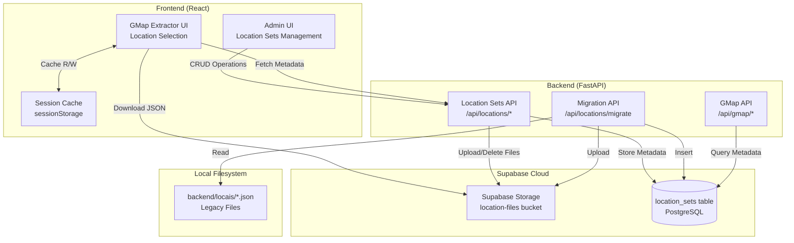

# Design Document

## Overview

The Location Sets Management System provides a cloud-based solution for managing geographic location collections used by the GMap extractor. The system replaces the current local file-based approach (`backend/locais/*.json`) with Supabase Storage and a metadata database table, enabling deployment to serverless platforms like Vercel.

The architecture consists of four main components:

1. **Supabase Storage**: Stores Location_JSON files as cloud objects with public read access
2. **Location_Sets Metadata Table**: PostgreSQL table storing metadata (name, description, file_path, location_count, created_at)
3. **Backend API**: FastAPI endpoints for CRUD operations on location sets
4. **Frontend UI**: Admin interface for managing location sets + GMap extractor integration

The system maintains backward compatibility with the existing GMap extractor by preserving the Location_JSON format: `{"nome": string, "descricao": string, "locais": string[]}`. A session cache layer optimizes performance by caching downloaded Location_JSON files in browser sessionStorage with a 1-hour TTL.

## Architecture

### System Components



### Data Flow

**Location Set Creation Flow:**
1. Admin pastes JSON array into Admin UI
2. Frontend validates JSON format
3. Frontend sends POST request to `/api/locations` with name, description, and JSON array
4. Backend generates UUID for file_path
5. Backend uploads JSON to Supabase Storage at `location-files/{uuid}.json`
6. Backend inserts metadata record into `location_sets` table
7. Backend returns success response with location_count
8. Frontend displays confirmation and refreshes list

**Location Set Selection Flow (GMap Extractor):**
1. GMap UI loads and fetches metadata from `/api/locations`
2. User selects location set from dropdown
3. Frontend checks sessionStorage for cached JSON (key: `location-set:{name}`)
4. If cache miss or expired (>1 hour), download from Supabase Storage
5. Store downloaded JSON in sessionStorage with timestamp
6. Parse JSON and populate city selection checkboxes
7. User proceeds with extraction using selected cities

**Location Set Deletion Flow:**
1. Admin clicks delete button in Admin UI
2. Frontend displays confirmation dialog
3. Frontend sends DELETE request to `/api/locations/{id}`
4. Backend deletes file from Supabase Storage
5. Backend deletes metadata record from `location_sets` table
6. Backend returns success response
7. Frontend refreshes location sets list

## Components and Interfaces

### Backend Components

#### 1. Location Sets Router (`backend/modules/locations/router.py`)

New FastAPI router for location set CRUD operations:

```python
from fastapi import APIRouter, HTTPException, Body
from pydantic import BaseModel, Field
from typing import List
import uuid
import json

router = APIRouter()

class LocationSetCreate(BaseModel):
    name: str = Field(..., min_length=3, max_length=100)
    description: str = Field(..., max_length=500)
    locations: List[str] = Field(..., min_items=1)

class LocationSetResponse(BaseModel):
    id: str
    name: str
    description: str
    file_path: str
    location_count: int
    created_at: str

@router.post("/", response_model=LocationSetResponse)
async def create_location_set(data: LocationSetCreate):
    """Create a new location set"""
    pass

@router.get("/", response_model=List[LocationSetResponse])
async def list_location_sets():
    """List all location sets"""
    pass

@router.get("/{location_set_id}/preview")
async def preview_location_set(location_set_id: str, limit: int = 10):
    """Preview first N locations from a set"""
    pass

@router.delete("/{location_set_id}")
async def delete_location_set(location_set_id: str):
    """Delete a location set"""
    pass

@router.post("/migrate")
async def migrate_local_files():
    """Migrate local JSON files to Supabase Storage"""
    pass
```


#### 2. Supabase Storage Client Extension

Extend existing `SupabaseClient` class with storage operations:

```python
class SupabaseClient:
    async def upload_location_file(self, file_path: str, content: dict) -> bool:
        """Upload Location_JSON to Supabase Storage"""
        pass
    
    async def download_location_file(self, file_path: str) -> dict:
        """Download Location_JSON from Supabase Storage"""
        pass
    
    async def delete_location_file(self, file_path: str) -> bool:
        """Delete Location_JSON from Supabase Storage"""
        pass
    
    async def insert_location_set(self, metadata: dict) -> dict:
        """Insert location set metadata into database"""
        pass
    
    async def get_location_sets(self) -> list[dict]:
        """Query all location sets ordered by created_at DESC"""
        pass
    
    async def delete_location_set(self, location_set_id: str) -> bool:
        """Delete location set metadata from database"""
        pass
```

#### 3. Migration Script

Standalone script for one-time migration of local files:

```python
# backend/scripts/migrate_location_sets.py
import asyncio
import os
import json
from database.supabase_client import get_supabase_client

async def migrate_local_files():
    """Migrate all JSON files from backend/locais/ to Supabase"""
    local_dir = "backend/locais"
    supabase = get_supabase_client()
    
    results = {"success": 0, "failed": 0, "skipped": 0}
    
    for filename in os.listdir(local_dir):
        if not filename.endswith('.json'):
            continue
        
        # Read and parse local file
        # Upload to Supabase Storage
        # Insert metadata record
        # Handle duplicates and errors
    
    return results
```

### Frontend Components

#### 1. Location Sets Admin Page (`frontend/src/pages/LocationSetsPage.jsx`)

New admin page for managing location sets:

```jsx
export default function LocationSetsPage() {
  const [locationSets, setLocationSets] = useState([])
  const [showCreateModal, setShowCreateModal] = useState(false)
  const [formData, setFormData] = useState({
    name: '',
    description: '',
    jsonInput: ''
  })
  
  // Load location sets on mount
  useEffect(() => {
    fetchLocationSets()
  }, [])
  
  const fetchLocationSets = async () => {
    const response = await fetch('/api/locations')
    const data = await response.json()
    setLocationSets(data)
  }
  
  const handleCreate = async () => {
    // Validate JSON
    // Parse locations array
    // POST to /api/locations
    // Refresh list
  }
  
  const handleDelete = async (id) => {
    // Show confirmation
    // DELETE to /api/locations/{id}
    // Refresh list
  }
  
  const handlePreview = async (id) => {
    // GET /api/locations/{id}/preview
    // Display in modal
  }
  
  return (
    <div>
      {/* Header with Create button */}
      {/* Location sets table/grid */}
      {/* Create modal */}
      {/* Preview modal */}
    </div>
  )
}
```

#### 2. GMap Extractor Integration

Modify existing `GMapPage.jsx` to use location sets API:

```jsx
// Replace local file loading with API calls
useEffect(() => {
  const loadLocationSets = async () => {
    try {
      const response = await fetch('/api/locations')
      const data = await response.json()
      setAvailableLocations(data)
      
      if (data.length > 0) {
        await loadLocationSetData(data[0].id)
      }
    } catch (err) {
      console.error('Failed to load location sets:', err)
    }
  }
  loadLocationSets()
}, [])

const loadLocationSetData = async (locationSetId) => {
  // Check session cache first
  const cacheKey = `location-set:${locationSetId}`
  const cached = sessionStorage.getItem(cacheKey)
  
  if (cached) {
    const { data, timestamp } = JSON.parse(cached)
    const age = Date.now() - timestamp
    
    if (age < 3600000) { // 1 hour TTL
      populateCities(data.locais)
      return
    }
  }
  
  // Cache miss or expired - download from Supabase
  const locationSet = availableLocations.find(ls => ls.id === locationSetId)
  const response = await fetch(locationSet.storage_url)
  const data = await response.json()
  
  // Store in session cache
  sessionStorage.setItem(cacheKey, JSON.stringify({
    data,
    timestamp: Date.now()
  }))
  
  populateCities(data.locais)
}
```

#### 3. Session Cache Utility

Utility module for session cache management:

```javascript
// frontend/src/utils/sessionCache.js
const CACHE_TTL = 3600000 // 1 hour in milliseconds

export const sessionCache = {
  get(key) {
    const cached = sessionStorage.getItem(key)
    if (!cached) return null
    
    const { data, timestamp } = JSON.parse(cached)
    const age = Date.now() - timestamp
    
    if (age > CACHE_TTL) {
      sessionStorage.removeItem(key)
      return null
    }
    
    return data
  },
  
  set(key, data) {
    sessionStorage.setItem(key, JSON.stringify({
      data,
      timestamp: Date.now()
    }))
  },
  
  clear(key) {
    sessionStorage.removeItem(key)
  },
  
  clearAll() {
    const keys = Object.keys(sessionStorage)
    keys.forEach(key => {
      if (key.startsWith('location-set:')) {
        sessionStorage.removeItem(key)
      }
    })
  }
}
```

## Data Models

### Database Schema

#### location_sets Table

```sql
CREATE TABLE IF NOT EXISTS location_sets (
    id UUID PRIMARY KEY DEFAULT gen_random_uuid(),
    name TEXT NOT NULL UNIQUE,
    description TEXT NOT NULL,
    file_path TEXT NOT NULL,
    location_count INTEGER NOT NULL,
    created_at TIMESTAMPTZ DEFAULT NOW()
);

CREATE INDEX IF NOT EXISTS idx_location_sets_name ON location_sets(name);
CREATE INDEX IF NOT EXISTS idx_location_sets_created_at ON location_sets(created_at DESC);
```

**Field Descriptions:**
- `id`: UUID primary key, auto-generated
- `name`: Unique human-readable name (3-100 characters)
- `description`: Optional description (max 500 characters)
- `file_path`: Supabase Storage path format: `{uuid}.json`
- `location_count`: Number of locations in the set (for display purposes)
- `created_at`: Timestamp of creation (for sorting)

**Constraints:**
- Primary key on `id`
- Unique constraint on `name` (prevents duplicate names)
- NOT NULL on `name`, `description`, `file_path`, `location_count`

**Indexes:**
- `idx_location_sets_name`: For name-based lookups
- `idx_location_sets_created_at`: For sorting by creation date (DESC)

### Supabase Storage Configuration

#### Bucket: location-files

```javascript
// Bucket configuration (created via Supabase Dashboard or API)
{
  "name": "location-files",
  "public": true,  // Public read access
  "file_size_limit": 10485760,  // 10MB max file size
  "allowed_mime_types": ["application/json"]
}
```

**Storage Policies:**
- Public read access (no authentication required for downloads)
- Authenticated write access (only backend can upload/delete)
- File size limit: 10MB per file
- Allowed MIME types: `application/json` only

**File Path Format:**
- Pattern: `{uuid}.json`
- Example: `a1b2c3d4-e5f6-7890-abcd-ef1234567890.json`
- Full URL: `https://{project}.supabase.co/storage/v1/object/public/location-files/{uuid}.json`

### Location_JSON Format

The Location_JSON file format maintains backward compatibility with existing local files:

```json
{
  "nome": "Capitais do Brasil",
  "descricao": "Todas as 27 capitais brasileiras",
  "locais": [
    "São Paulo, SP",
    "Rio de Janeiro, RJ",
    "Belo Horizonte, MG",
    "Curitiba, PR"
  ]
}
```

**Field Descriptions:**
- `nome`: Name of the location set (optional, falls back to metadata name)
- `descricao`: Description of the location set (optional, falls back to metadata description)
- `locais`: Array of location strings (required, min 1 item)

**Validation Rules:**
- `locais` array must contain at least 1 element
- Each location string must be non-empty after trimming
- Total file size must not exceed 10MB
- File must be valid JSON

### API Request/Response Models

#### Create Location Set Request

```json
{
  "name": "Capitais do Brasil",
  "description": "Todas as 27 capitais brasileiras",
  "locations": [
    "São Paulo, SP",
    "Rio de Janeiro, RJ",
    "Belo Horizonte, MG"
  ]
}
```

#### Location Set Response

```json
{
  "id": "a1b2c3d4-e5f6-7890-abcd-ef1234567890",
  "name": "Capitais do Brasil",
  "description": "Todas as 27 capitais brasileiras",
  "file_path": "a1b2c3d4-e5f6-7890-abcd-ef1234567890.json",
  "location_count": 27,
  "created_at": "2025-01-15T10:30:00Z",
  "storage_url": "https://project.supabase.co/storage/v1/object/public/location-files/a1b2c3d4-e5f6-7890-abcd-ef1234567890.json"
}
```

#### Preview Response

```json
{
  "id": "a1b2c3d4-e5f6-7890-abcd-ef1234567890",
  "name": "Capitais do Brasil",
  "preview": [
    "São Paulo, SP",
    "Rio de Janeiro, RJ",
    "Belo Horizonte, MG",
    "Curitiba, PR",
    "Porto Alegre, RS",
    "Salvador, BA",
    "Brasília, DF",
    "Fortaleza, CE",
    "Recife, PE",
    "Goiânia, GO"
  ],
  "total_count": 27,
  "showing": 10
}
```

#### Migration Response

```json
{
  "success": 2,
  "failed": 0,
  "skipped": 1,
  "details": [
    {
      "filename": "brasil-capitais.json",
      "status": "success",
      "location_count": 27
    },
    {
      "filename": "sudeste-brasil.json",
      "status": "success",
      "location_count": 4
    },
    {
      "filename": "existing-set.json",
      "status": "skipped",
      "reason": "Location set with name 'Existing Set' already exists"
    }
  ]
}
```


## Correctness Properties

A property is a characteristic or behavior that should hold true across all valid executions of a system-essentially, a formal statement about what the system should do. Properties serve as the bridge between human-readable specifications and machine-verifiable correctness guarantees.

### Property Reflection

After analyzing all acceptance criteria, I identified the following redundancies and consolidations:

- Properties 2.4 and 2.5 (upload to storage + insert to database) can be combined into a single "creation round trip" property
- Properties 5.2 and 5.3 (delete from storage + delete from database) can be combined into a single "deletion completeness" property
- Properties 6.3 and 6.4 (cache check + download on miss) can be combined into a single "cache-or-download" property
- Properties 7.3 and 7.4 (TTL check + re-download) can be combined into a single "cache expiration" property
- Properties 10.5 and 10.6 (validate string array + error on non-string) can be combined into a single validation property
- Properties 12.1, 12.2, and 12.3 (verify locais array + min 1 item + error message) can be combined into a single validation property
- Properties 12.4 and 12.5 (non-empty strings + trim whitespace) can be combined into a single normalization property

### Property 1: Storage Path Format Consistency

For any location set created, the file_path stored in the database should match the format `{uuid}.json` where uuid is a valid UUID v4.

**Validates: Requirements 1.3**

### Property 2: UUID Uniqueness

For any collection of location sets created, all generated UUIDs for file_path should be unique (no duplicates).

**Validates: Requirements 1.4**

### Property 3: Duplicate Name Rejection

For any location set name that already exists in the database, attempting to create another location set with the same name should return an error indicating the duplicate name.

**Validates: Requirements 1.6, 2.6**

### Property 4: JSON Validation

For any string input, the JSON validator should correctly identify whether it is valid JSON (parseable) or invalid JSON (unparseable).

**Validates: Requirements 2.1**

### Property 5: Location Count Accuracy

For any valid JSON array of locations, the location_count stored in the database should equal the length of the locations array.

**Validates: Requirements 2.3, 2.7**

### Property 6: Creation Round Trip

For any valid location set (name, description, locations array), after successful creation, querying the database should return a record with matching name, description, and location_count, and the file should exist in Supabase Storage at the specified file_path.

**Validates: Requirements 2.4, 2.5**

### Property 7: List Completeness

For any collection of location sets created, the list endpoint should return all of them with all required fields (id, name, description, file_path, location_count, created_at).

**Validates: Requirements 3.1, 3.2**

### Property 8: List Sorting Order

For any collection of location sets with different created_at timestamps, the list endpoint should return them sorted by created_at in descending order (newest first).

**Validates: Requirements 3.3**

### Property 9: Preview Length Limit

For any location set, the preview endpoint should return at most 10 locations, or all locations if the set contains fewer than 10.

**Validates: Requirements 4.2, 4.3, 4.4**

### Property 10: Preview Content Accuracy

For any location set, the preview endpoint should return the first N locations in the same order as they appear in the stored JSON file.

**Validates: Requirements 4.1, 4.2**

### Property 11: Deletion Completeness

For any location set, after successful deletion, both the database record and the Supabase Storage file should no longer exist.

**Validates: Requirements 5.2, 5.3, 5.5**

### Property 12: Deletion Resilience

For any location set, if the Supabase Storage file deletion fails, the database record should still be deleted and the operation should log the error.

**Validates: Requirements 5.4**

### Property 13: Cache-or-Download Behavior

For any location set selection, if the location JSON is in session cache and not expired, it should be used; otherwise, it should be downloaded from Supabase Storage.

**Validates: Requirements 6.3, 6.4**

### Property 14: Cache Storage Format

For any location JSON downloaded, it should be stored in session cache with key format `location-set:{id}` and include both the data and a timestamp.

**Validates: Requirements 7.1, 7.2**

### Property 15: Cache Expiration

For any cached location JSON entry, if the timestamp is older than 1 hour (3600000 milliseconds), it should be treated as expired and trigger a fresh download.

**Validates: Requirements 7.3, 7.4**

### Property 16: Lazy Loading

For any page load of the GMap extractor, no location JSON files should be downloaded until a user explicitly selects a location set.

**Validates: Requirements 8.3**

### Property 17: Migration File Discovery

For any JSON files in the `backend/locais/` directory, the migration endpoint should discover and attempt to process all of them.

**Validates: Requirements 9.2**

### Property 18: Migration Completeness

For any valid JSON file in the migration directory, after successful migration, a corresponding location set should exist in the database and Supabase Storage.

**Validates: Requirements 9.3, 9.4, 9.5**

### Property 19: Migration Duplicate Handling

For any JSON file in the migration directory with a name matching an existing location set, the migration should skip that file and include it in the "skipped" count.

**Validates: Requirements 9.6**

### Property 20: Migration Idempotency

For any migration operation, running it multiple times should produce the same final state (same location sets exist, duplicates are skipped).

**Validates: Requirements 9.8**

### Property 21: Error Message Specificity

For any operation that fails (upload, download, parsing, database), the error response should include a descriptive message indicating the type of failure.

**Validates: Requirements 10.1, 10.2, 10.3, 10.4**

### Property 22: Location Array Type Validation

For any locations array, all elements should be strings; if any element is not a string, the validation should fail with error "Invalid location format".

**Validates: Requirements 10.5, 10.6**

### Property 23: Name Length Validation

For any location set name, it should be between 3 and 100 characters (inclusive); names outside this range should be rejected.

**Validates: Requirements 10.7**

### Property 24: Description Length Validation

For any location set description, it should be no longer than 500 characters; descriptions exceeding this limit should be rejected.

**Validates: Requirements 10.8**

### Property 25: JSON Format Compatibility

For any location JSON file, it should be parseable with the structure `{"nome": string, "descricao": string, "locais": string[]}` or with only `{"locais": string[]}` for backward compatibility.

**Validates: Requirements 11.1, 11.2**

### Property 26: Metadata Fallback

For any location JSON file lacking "nome" or "descricao" fields, the system should use the corresponding values from the location_sets table metadata.

**Validates: Requirements 11.3**

### Property 27: Location Array Validation

For any location JSON, it must contain a "locais" array with at least 1 non-empty string; empty arrays or missing "locais" should be rejected with error "Location set must contain at least one location".

**Validates: Requirements 12.1, 12.2, 12.3, 12.4**

### Property 28: Location String Normalization

For any location string in a locations array, leading and trailing whitespace should be trimmed before storage.

**Validates: Requirements 12.5**

### Property 29: File Size Limit

For any location JSON file, if it exceeds 10MB, it should be rejected with an error message indicating the size limit.

**Validates: Requirements 12.6**


## Error Handling

### Error Categories

The system handles four main categories of errors:

1. **Validation Errors**: Invalid input data (malformed JSON, invalid lengths, empty arrays)
2. **Storage Errors**: Supabase Storage operations failures (upload, download, delete)
3. **Database Errors**: PostgreSQL operations failures (insert, query, delete, constraint violations)
4. **Network Errors**: Connection failures, timeouts, rate limiting

### Error Response Format

All API endpoints return errors in a consistent format:

```json
{
  "error": "error_code",
  "message": "Human-readable error message",
  "details": {
    "field": "Additional context"
  }
}
```

### Validation Error Handling

**JSON Parsing Errors:**
```python
try:
    locations = json.loads(json_input)
except json.JSONDecodeError as e:
    raise HTTPException(
        status_code=400,
        detail={
            "error": "invalid_json",
            "message": f"Failed to parse JSON: {str(e)}",
            "details": {"position": e.pos, "line": e.lineno}
        }
    )
```

**Field Validation Errors:**
```python
# Name length validation
if len(name) < 3 or len(name) > 100:
    raise HTTPException(
        status_code=400,
        detail={
            "error": "invalid_name_length",
            "message": "Location set name must be between 3 and 100 characters",
            "details": {"name_length": len(name)}
        }
    )

# Description length validation
if len(description) > 500:
    raise HTTPException(
        status_code=400,
        detail={
            "error": "invalid_description_length",
            "message": "Location set description must not exceed 500 characters",
            "details": {"description_length": len(description)}
        }
    )

# Empty locations array
if not locations or len(locations) == 0:
    raise HTTPException(
        status_code=400,
        detail={
            "error": "empty_locations",
            "message": "Location set must contain at least one location"
        }
    )

# Non-string location values
if not all(isinstance(loc, str) for loc in locations):
    raise HTTPException(
        status_code=400,
        detail={
            "error": "invalid_location_format",
            "message": "All locations must be strings"
        }
    )
```

### Storage Error Handling

**Upload Failures:**
```python
try:
    await supabase_client.upload_location_file(file_path, location_json)
except httpx.HTTPStatusError as e:
    if e.response.status_code == 413:
        raise HTTPException(
            status_code=413,
            detail={
                "error": "file_too_large",
                "message": "Location file exceeds 10MB size limit"
            }
        )
    else:
        logger.error(f"Storage upload failed: {e}")
        raise HTTPException(
            status_code=500,
            detail={
                "error": "upload_failed",
                "message": "Failed to upload location file to storage"
            }
        )
```

**Download Failures:**
```python
try:
    location_json = await supabase_client.download_location_file(file_path)
except httpx.HTTPStatusError as e:
    if e.response.status_code == 404:
        raise HTTPException(
            status_code=404,
            detail={
                "error": "file_not_found",
                "message": "Location file not found in storage"
            }
        )
    else:
        logger.error(f"Storage download failed: {e}")
        raise HTTPException(
            status_code=500,
            detail={
                "error": "download_failed",
                "message": "Failed to load location set from storage"
            }
        )
```

**Delete Failures (Graceful Degradation):**
```python
try:
    await supabase_client.delete_location_file(file_path)
except Exception as e:
    # Log error but continue with database deletion
    logger.error(
        f"Failed to delete storage file {file_path}: {e}",
        extra={"file_path": file_path, "error": str(e)}
    )
    # Don't raise exception - proceed with database deletion

# Always attempt database deletion
await supabase_client.delete_location_set(location_set_id)
```

### Database Error Handling

**Duplicate Name Constraint Violation:**
```python
try:
    await supabase_client.insert_location_set(metadata)
except Exception as e:
    if "unique constraint" in str(e).lower() or "duplicate key" in str(e).lower():
        raise HTTPException(
            status_code=409,
            detail={
                "error": "duplicate_name",
                "message": f"Location set with name '{name}' already exists"
            }
        )
    else:
        logger.error(f"Database insert failed: {e}")
        raise HTTPException(
            status_code=500,
            detail={
                "error": "database_error",
                "message": "Failed to create location set"
            }
        )
```

**Query Failures:**
```python
try:
    location_sets = await supabase_client.get_location_sets()
except Exception as e:
    logger.error(f"Database query failed: {e}")
    raise HTTPException(
        status_code=500,
        detail={
            "error": "database_error",
            "message": "Failed to retrieve location sets"
        }
    )
```

### Network Error Handling

**Retry Strategy with Exponential Backoff:**
```python
async def upload_with_retry(file_path: str, content: dict, max_retries: int = 3):
    for attempt in range(max_retries):
        try:
            return await supabase_client.upload_location_file(file_path, content)
        except (httpx.ConnectError, httpx.TimeoutException) as e:
            if attempt < max_retries - 1:
                wait_time = (2 ** attempt) + random.uniform(0, 1)
                logger.warning(
                    f"Network error on attempt {attempt + 1}, retrying in {wait_time:.2f}s",
                    extra={"error": str(e), "attempt": attempt + 1}
                )
                await asyncio.sleep(wait_time)
            else:
                logger.error(f"Network error after {max_retries} attempts: {e}")
                raise HTTPException(
                    status_code=503,
                    detail={
                        "error": "network_error",
                        "message": "Failed to connect to storage service after multiple retries"
                    }
                )
```

### Frontend Error Handling

**User-Friendly Error Display:**
```javascript
const handleCreate = async () => {
  try {
    const response = await fetch('/api/locations', {
      method: 'POST',
      headers: { 'Content-Type': 'application/json' },
      body: JSON.stringify({ name, description, locations })
    })
    
    if (!response.ok) {
      const error = await response.json()
      
      // Display specific error messages
      switch (error.error) {
        case 'invalid_json':
          setError(`JSON parsing failed: ${error.message}`)
          break
        case 'duplicate_name':
          setError(`A location set named "${name}" already exists`)
          break
        case 'empty_locations':
          setError('Please provide at least one location')
          break
        case 'file_too_large':
          setError('Location file is too large (max 10MB)')
          break
        default:
          setError(error.message || 'Failed to create location set')
      }
      return
    }
    
    // Success handling
    const data = await response.json()
    setSuccess(`Created location set with ${data.location_count} locations`)
    fetchLocationSets()
  } catch (err) {
    setError('Network error: Please check your connection')
  }
}
```

### Session Cache Error Handling

**Quota Exceeded Handling:**
```javascript
export const sessionCache = {
  set(key, data) {
    try {
      sessionStorage.setItem(key, JSON.stringify({
        data,
        timestamp: Date.now()
      }))
    } catch (e) {
      if (e.name === 'QuotaExceededError') {
        // Clear oldest entries and retry
        this.clearOldest()
        try {
          sessionStorage.setItem(key, JSON.stringify({
            data,
            timestamp: Date.now()
          }))
        } catch (retryError) {
          console.error('Failed to cache after clearing:', retryError)
          // Continue without caching
        }
      }
    }
  },
  
  clearOldest() {
    const entries = []
    for (let i = 0; i < sessionStorage.length; i++) {
      const key = sessionStorage.key(i)
      if (key.startsWith('location-set:')) {
        const value = JSON.parse(sessionStorage.getItem(key))
        entries.push({ key, timestamp: value.timestamp })
      }
    }
    
    // Sort by timestamp and remove oldest
    entries.sort((a, b) => a.timestamp - b.timestamp)
    if (entries.length > 0) {
      sessionStorage.removeItem(entries[0].key)
    }
  }
}
```

## Testing Strategy

### Dual Testing Approach

The testing strategy combines unit tests for specific examples and edge cases with property-based tests for universal properties across all inputs. Both approaches are complementary and necessary for comprehensive coverage.

**Unit Tests Focus:**
- Specific examples that demonstrate correct behavior
- Edge cases (empty arrays, boundary values, special characters)
- Error conditions and error message validation
- Integration points between components

**Property-Based Tests Focus:**
- Universal properties that hold for all inputs
- Comprehensive input coverage through randomization
- Invariants that must be maintained across operations
- Round-trip properties (serialization, caching, CRUD operations)

### Property-Based Testing Configuration

**Library Selection:**
- Python backend: `hypothesis` (mature, well-integrated with pytest)
- JavaScript frontend: `fast-check` (TypeScript support, good React integration)

**Test Configuration:**
```python
# pytest.ini or conftest.py
from hypothesis import settings, Verbosity

# Configure hypothesis for all tests
settings.register_profile("default", max_examples=100, verbosity=Verbosity.normal)
settings.register_profile("ci", max_examples=200, verbosity=Verbosity.verbose)
settings.load_profile("default")
```

**Minimum Iterations:**
- Each property test must run at least 100 iterations
- CI environment should run 200 iterations for higher confidence
- Critical properties (data integrity, security) should run 500+ iterations

**Test Tagging Format:**
```python
@pytest.mark.property
def test_storage_path_format_consistency():
    """
    Feature: location-sets-management
    Property 1: For any location set created, the file_path stored in the 
    database should match the format {uuid}.json where uuid is a valid UUID v4.
    """
    pass
```

### Backend Unit Tests

**Test File Structure:**
```
backend/modules/locations/
├── router.py
├── test_router.py              # Unit tests for API endpoints
├── test_router_properties.py   # Property-based tests
└── test_integration.py          # Integration tests with Supabase
```

**Example Unit Tests:**
```python
# test_router.py
import pytest
from fastapi.testclient import TestClient

def test_create_location_set_success(client: TestClient):
    """Test successful location set creation"""
    response = client.post("/api/locations", json={
        "name": "Test Capitals",
        "description": "Test description",
        "locations": ["São Paulo, SP", "Rio de Janeiro, RJ"]
    })
    assert response.status_code == 200
    data = response.json()
    assert data["name"] == "Test Capitals"
    assert data["location_count"] == 2
    assert "id" in data
    assert "file_path" in data

def test_create_location_set_duplicate_name(client: TestClient):
    """Test duplicate name rejection"""
    # Create first location set
    client.post("/api/locations", json={
        "name": "Duplicate Test",
        "description": "First",
        "locations": ["São Paulo, SP"]
    })
    
    # Attempt to create duplicate
    response = client.post("/api/locations", json={
        "name": "Duplicate Test",
        "description": "Second",
        "locations": ["Rio de Janeiro, RJ"]
    })
    assert response.status_code == 409
    error = response.json()
    assert error["error"] == "duplicate_name"

def test_create_location_set_empty_locations(client: TestClient):
    """Test empty locations array rejection"""
    response = client.post("/api/locations", json={
        "name": "Empty Test",
        "description": "Test",
        "locations": []
    })
    assert response.status_code == 400
    error = response.json()
    assert error["error"] == "empty_locations"
    assert "at least one location" in error["message"]

def test_list_location_sets_empty(client: TestClient):
    """Test listing when no location sets exist"""
    response = client.get("/api/locations")
    assert response.status_code == 200
    assert response.json() == []

def test_preview_location_set_limit(client: TestClient):
    """Test preview returns at most 10 locations"""
    # Create location set with 15 locations
    locations = [f"City {i}, ST" for i in range(15)]
    create_response = client.post("/api/locations", json={
        "name": "Preview Test",
        "description": "Test",
        "locations": locations
    })
    location_set_id = create_response.json()["id"]
    
    # Request preview
    response = client.get(f"/api/locations/{location_set_id}/preview")
    assert response.status_code == 200
    data = response.json()
    assert len(data["preview"]) == 10
    assert data["total_count"] == 15
    assert data["showing"] == 10
```

### Backend Property-Based Tests

**Example Property Tests:**
```python
# test_router_properties.py
import pytest
from hypothesis import given, strategies as st
from fastapi.testclient import TestClient
import uuid
import re

@pytest.mark.property
@given(
    name=st.text(min_size=3, max_size=100),
    description=st.text(max_size=500),
    locations=st.lists(st.text(min_size=1), min_size=1, max_size=100)
)
def test_property_storage_path_format(client: TestClient, name, description, locations):
    """
    Feature: location-sets-management
    Property 1: For any location set created, the file_path stored in the 
    database should match the format {uuid}.json where uuid is a valid UUID v4.
    """
    response = client.post("/api/locations", json={
        "name": name,
        "description": description,
        "locations": locations
    })
    
    if response.status_code == 200:
        data = response.json()
        file_path = data["file_path"]
        
        # Verify format: {uuid}.json
        assert file_path.endswith(".json")
        uuid_part = file_path[:-5]  # Remove .json
        
        # Verify it's a valid UUID
        try:
            parsed_uuid = uuid.UUID(uuid_part, version=4)
            assert str(parsed_uuid) == uuid_part
        except ValueError:
            pytest.fail(f"Invalid UUID in file_path: {uuid_part}")

@pytest.mark.property
@given(
    locations_list=st.lists(
        st.lists(st.text(min_size=1), min_size=1, max_size=50),
        min_size=2,
        max_size=10
    )
)
def test_property_uuid_uniqueness(client: TestClient, locations_list):
    """
    Feature: location-sets-management
    Property 2: For any collection of location sets created, all generated 
    UUIDs for file_path should be unique (no duplicates).
    """
    created_ids = []
    
    for i, locations in enumerate(locations_list):
        response = client.post("/api/locations", json={
            "name": f"Test Set {i} {uuid.uuid4()}",  # Ensure unique names
            "description": f"Test {i}",
            "locations": locations
        })
        
        if response.status_code == 200:
            data = response.json()
            file_path = data["file_path"]
            uuid_part = file_path[:-5]
            created_ids.append(uuid_part)
    
    # Verify all UUIDs are unique
    assert len(created_ids) == len(set(created_ids))

@pytest.mark.property
@given(
    locations=st.lists(st.text(min_size=1), min_size=1, max_size=100)
)
def test_property_location_count_accuracy(client: TestClient, locations):
    """
    Feature: location-sets-management
    Property 5: For any valid JSON array of locations, the location_count 
    stored in the database should equal the length of the locations array.
    """
    response = client.post("/api/locations", json={
        "name": f"Count Test {uuid.uuid4()}",
        "description": "Test",
        "locations": locations
    })
    
    if response.status_code == 200:
        data = response.json()
        assert data["location_count"] == len(locations)

@pytest.mark.property
@given(
    name=st.text(min_size=3, max_size=100),
    description=st.text(max_size=500),
    locations=st.lists(st.text(min_size=1), min_size=1, max_size=50)
)
def test_property_creation_round_trip(client: TestClient, supabase_client, name, description, locations):
    """
    Feature: location-sets-management
    Property 6: For any valid location set, after successful creation, 
    querying the database should return a record with matching data, and 
    the file should exist in Supabase Storage.
    """
    # Create location set
    response = client.post("/api/locations", json={
        "name": name,
        "description": description,
        "locations": locations
    })
    
    if response.status_code == 200:
        data = response.json()
        location_set_id = data["id"]
        
        # Verify database record
        list_response = client.get("/api/locations")
        all_sets = list_response.json()
        created_set = next((s for s in all_sets if s["id"] == location_set_id), None)
        
        assert created_set is not None
        assert created_set["name"] == name
        assert created_set["description"] == description
        assert created_set["location_count"] == len(locations)
        
        # Verify file exists in storage
        file_exists = await supabase_client.check_file_exists(data["file_path"])
        assert file_exists

@pytest.mark.property
@given(
    locations=st.lists(st.text(min_size=1), min_size=1, max_size=100)
)
def test_property_location_string_normalization(client: TestClient, locations):
    """
    Feature: location-sets-management
    Property 28: For any location string in a locations array, leading and 
    trailing whitespace should be trimmed before storage.
    """
    # Add whitespace to locations
    locations_with_whitespace = [f"  {loc}  " for loc in locations]
    
    response = client.post("/api/locations", json={
        "name": f"Trim Test {uuid.uuid4()}",
        "description": "Test",
        "locations": locations_with_whitespace
    })
    
    if response.status_code == 200:
        data = response.json()
        location_set_id = data["id"]
        
        # Download and verify trimmed
        preview_response = client.get(f"/api/locations/{location_set_id}/preview?limit=1000")
        preview_data = preview_response.json()
        
        for stored_loc in preview_data["preview"]:
            assert stored_loc == stored_loc.strip()
            assert not stored_loc.startswith(" ")
            assert not stored_loc.endswith(" ")
```

### Frontend Unit Tests

**Test File Structure:**
```
frontend/src/
├── pages/
│   ├── LocationSetsPage.jsx
│   ├── LocationSetsPage.test.jsx
│   └── GMapPage.test.jsx
└── utils/
    ├── sessionCache.js
    └── sessionCache.test.js
```

**Example Frontend Tests:**
```javascript
// sessionCache.test.js
import { sessionCache } from './sessionCache'

describe('sessionCache', () => {
  beforeEach(() => {
    sessionStorage.clear()
  })
  
  test('stores and retrieves data with timestamp', () => {
    const testData = { locais: ['São Paulo, SP'] }
    sessionCache.set('location-set:test', testData)
    
    const retrieved = sessionCache.get('location-set:test')
    expect(retrieved).toEqual(testData)
  })
  
  test('returns null for expired cache (>1 hour)', () => {
    const testData = { locais: ['São Paulo, SP'] }
    
    // Mock old timestamp
    const oldTimestamp = Date.now() - (3600000 + 1000) // 1 hour + 1 second ago
    sessionStorage.setItem('location-set:test', JSON.stringify({
      data: testData,
      timestamp: oldTimestamp
    }))
    
    const retrieved = sessionCache.get('location-set:test')
    expect(retrieved).toBeNull()
    expect(sessionStorage.getItem('location-set:test')).toBeNull()
  })
  
  test('handles quota exceeded by clearing oldest entries', () => {
    // Fill storage
    for (let i = 0; i < 100; i++) {
      sessionCache.set(`location-set:test${i}`, { data: `test${i}` })
    }
    
    // Mock quota exceeded
    const originalSetItem = Storage.prototype.setItem
    Storage.prototype.setItem = jest.fn(() => {
      throw new DOMException('QuotaExceededError')
    })
    
    // Should not throw
    expect(() => {
      sessionCache.set('location-set:new', { data: 'new' })
    }).not.toThrow()
    
    Storage.prototype.setItem = originalSetItem
  })
})
```

### Integration Tests

**Supabase Integration Tests:**
```python
# test_integration.py
import pytest
import asyncio
from database.supabase_client import get_supabase_client

@pytest.mark.integration
@pytest.mark.asyncio
async def test_full_crud_cycle():
    """Test complete CRUD cycle with real Supabase"""
    client = get_supabase_client()
    
    if not client.is_available():
        pytest.skip("Supabase credentials not available")
    
    # Create
    metadata = {
        "name": "Integration Test Set",
        "description": "Test description",
        "file_path": f"{uuid.uuid4()}.json",
        "location_count": 3
    }
    location_json = {
        "nome": "Integration Test Set",
        "descricao": "Test description",
        "locais": ["City 1, ST", "City 2, ST", "City 3, ST"]
    }
    
    # Upload file
    upload_success = await client.upload_location_file(
        metadata["file_path"],
        location_json
    )
    assert upload_success
    
    # Insert metadata
    created = await client.insert_location_set(metadata)
    assert created["id"] is not None
    location_set_id = created["id"]
    
    # Read
    all_sets = await client.get_location_sets()
    assert any(s["id"] == location_set_id for s in all_sets)
    
    # Download file
    downloaded = await client.download_location_file(metadata["file_path"])
    assert downloaded["locais"] == location_json["locais"]
    
    # Delete
    delete_success = await client.delete_location_set(location_set_id)
    assert delete_success
    
    # Verify deletion
    all_sets_after = await client.get_location_sets()
    assert not any(s["id"] == location_set_id for s in all_sets_after)
```

### Test Coverage Goals

- Unit test coverage: >80% for all modules
- Property test coverage: 100% of correctness properties
- Integration test coverage: All critical paths (CRUD operations, migration)
- E2E test coverage: Key user workflows (create location set, select in GMap extractor, delete)

### Continuous Integration

**GitHub Actions Workflow:**
```yaml
name: Test Location Sets Management

on: [push, pull_request]

jobs:
  test:
    runs-on: ubuntu-latest
    
    steps:
      - uses: actions/checkout@v2
      
      - name: Set up Python
        uses: actions/setup-python@v2
        with:
          python-version: '3.11'
      
      - name: Install dependencies
        run: |
          pip install -r requirements.txt
          pip install pytest hypothesis pytest-asyncio
      
      - name: Run unit tests
        run: pytest backend/modules/locations/test_router.py -v
      
      - name: Run property-based tests
        run: pytest backend/modules/locations/test_router_properties.py -v --hypothesis-profile=ci
      
      - name: Run integration tests
        if: env.SUPABASE_URL && env.SUPABASE_KEY
        run: pytest backend/modules/locations/test_integration.py -v -m integration
        env:
          SUPABASE_URL: ${{ secrets.SUPABASE_URL }}
          SUPABASE_KEY: ${{ secrets.SUPABASE_KEY }}
```
